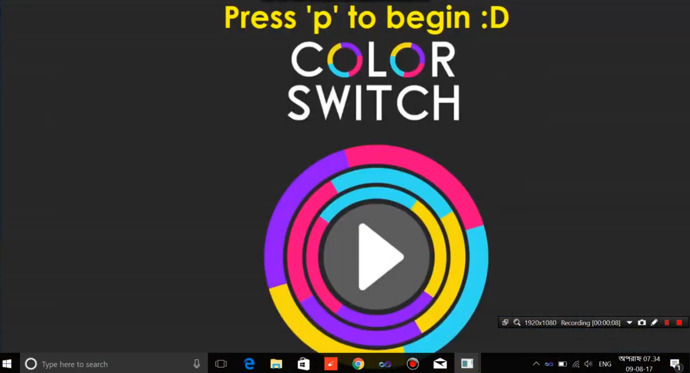

# Color Switch MAT Desktop Game
### 1st year 2nd semester's iGraphics Project 
A game in which players need to pass a ball that changes color through different obstacles by matching colors with it. If the player fails to match color then the game is over for that person. Otherwise, they get points. The game contains 3 types of playing modes, Fidget Spinner, Hophop and Classic. The inspiration for the game was taken from the android game of the same name.

Platform: Visual Studio, Language: C

Some of the images of the game are shown below.

* Welcome page  

* Menu page  

* Sample page  

Demonstration of the game is given <a href="https://youtu.be/EHN9QzNsLPw">Here</a>. 
Instruction for playing the game is provided <a href="https://youtu.be/3iQXPZuHQVE">Here</a>.

